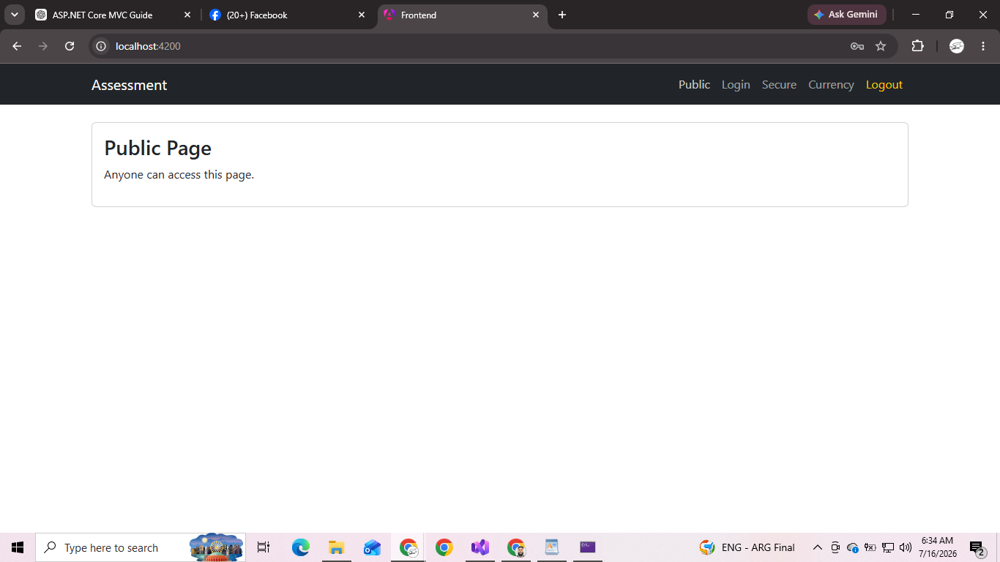
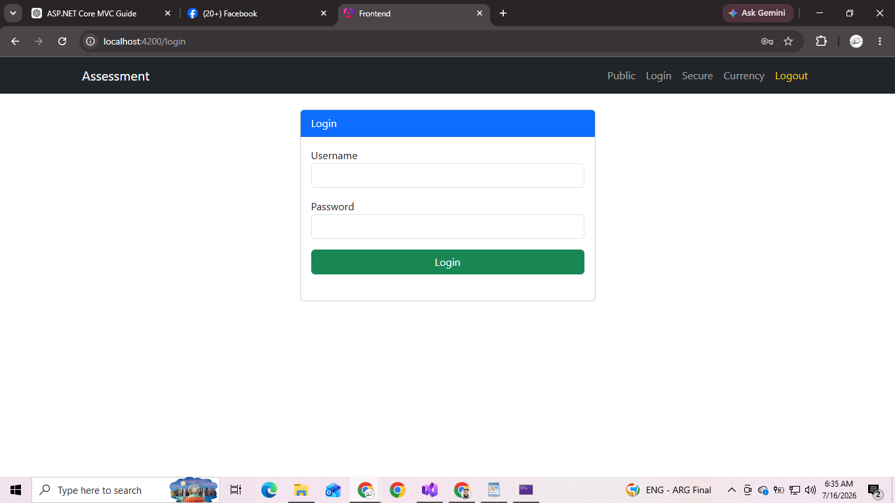
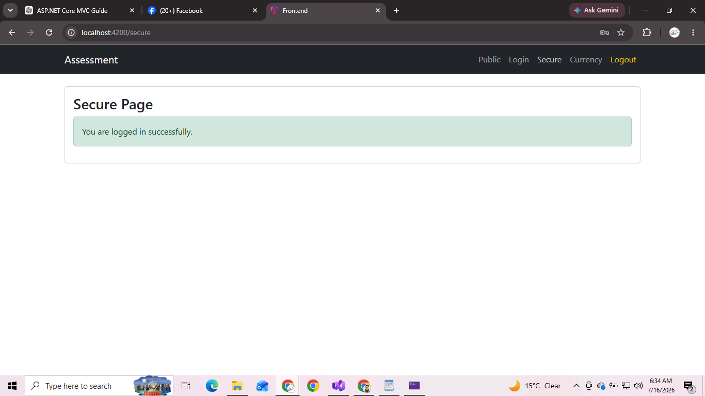
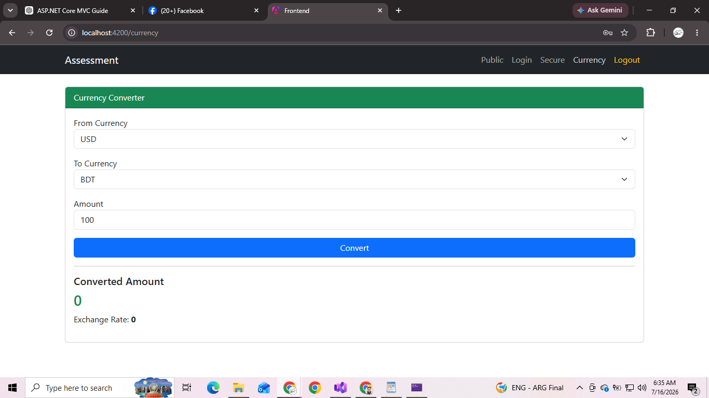
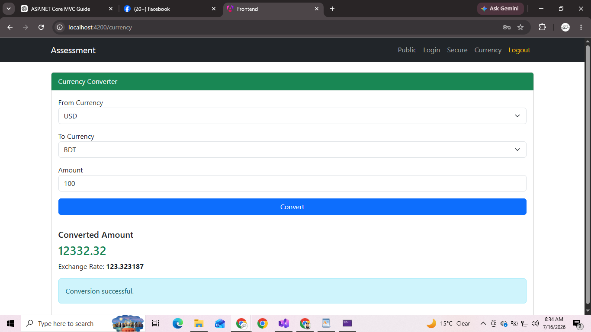
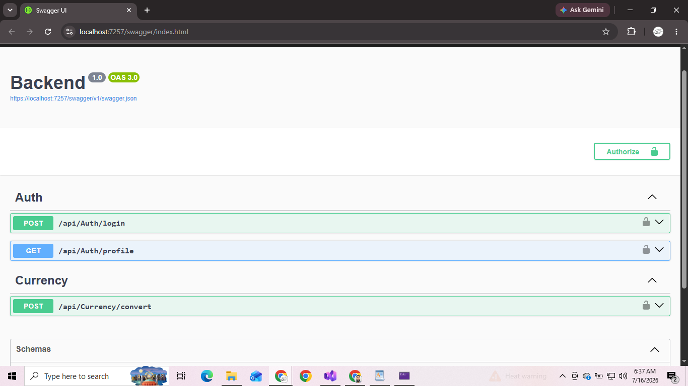

# Trainee Software Engineer Technical Assessment

## Overview

This project was developed as part of the **Trainee Software Engineer Technical Assessment**.

The application consists of two separate projects:

- **Backend:** ASP.NET Core Web API (.NET 8)
- **Frontend:** Angular 21 (Standalone)

The project demonstrates:

- JWT Authentication
- Authorization
- Protected Routes
- Third-Party Currency Exchange API Integration
- Angular HTTP Communication
- REST API Development
- Clean Architecture
- Dependency Injection

---

# Technology Stack

## Backend

- ASP.NET Core Web API (.NET 8)
- JWT Authentication
- REST API
- Dependency Injection
- HttpClient
- Swagger

## Frontend

- Angular 21 (Standalone)
- TypeScript
- Bootstrap 5
- Reactive Routing
- Route Guards
- HTTP Interceptor
- FormsModule

---

# Project Structure

```
TraineeAssessment
│
├── Backend
│     ├── Controllers
│     ├── DTOs
│     ├── Interfaces
│     ├── Services
│     ├── Program.cs
│     └── appsettings.json
│
└── Frontend
      ├── src
      │     ├── app
      │     │     ├── components
      │     │     ├── guards
      │     │     ├── interceptors
      │     │     ├── models
      │     │     └── services
      │     └── environments
      └── angular.json
```

---

# Features

## Authentication

- JWT Authentication
- No Database Required
- Credentials stored in configuration
- Login API
- Protected APIs
- Route Guard
- JWT Interceptor
- Logout

---

## Public Page

Accessible by everyone.

No authentication required.

---

## Login Page

User logs in using predefined credentials.

Successful login:

- Generates JWT Token
- Stores token in Local Storage
- Redirects to Secure Page

---

## Secure Page

Only authenticated users can access this page.

Unauthenticated users are redirected to Login.

---

## Currency Converter

Users can:

- Select Source Currency
- Select Destination Currency
- Enter Amount
- Convert Currency
- View Exchange Rate
- View Converted Amount

Currency conversion is performed through the ASP.NET Core Web API which communicates with a third-party Currency Exchange API.

---

# Authentication

The application uses **JWT (JSON Web Token)** authentication.

Workflow:

```
Login
      ↓
Backend validates credentials
      ↓
JWT Token Generated
      ↓
Angular stores Token
      ↓
HTTP Interceptor
      ↓
Protected API Calls
```

---

# Default Login Credentials

| Username | Password |
|----------|----------|
| admin | admin123 |

---

# API Endpoints

## Authentication

### Login

```
POST /api/Auth/login
```

### Get Profile

```
GET /api/Auth/profile
```

Requires JWT Token.

---

## Currency

### Convert Currency

```
POST /api/Currency/convert
```

Sample Request

```json
{
    "fromCurrency": "USD",
    "toCurrency": "BDT",
    "amount": 100
}
```

Sample Response

```json
{
    "success": true,
    "amount": 100,
    "convertedAmount": 12332.32,
    "exchangeRate": 123.323187,
    "fromCurrency": "USD",
    "toCurrency": "BDT",
    "message": "Conversion successful."
}
```

---

# Installation

## Clone Repository

```bash
git clone https://github.com/yourusername/TraineeAssessment.git
```

---

## Backend

Navigate to Backend

```bash
cd Backend
```

Restore packages

```bash
dotnet restore
```

Run

```bash
dotnet run
```

Swagger

```
https://localhost:7257/swagger
```

---

## Frontend

Navigate to Frontend

```bash
cd frontend
```

Install Packages

```bash
npm install
```

Run

```bash
ng serve
```

Angular Application

```
http://localhost:4200
```

---

# Configuration

## Backend

Update **appsettings.json**

```json
"Jwt": {

  "Key": "YourSecretKey",

  "Issuer": "BackendAPI",

  "Audience": "Frontend"

}
```

Update Authentication Credentials

```json
"User": {

  "Username": "admin",

  "Password": "admin123"

}
```

---

## Frontend

Update

```
src/environments/environment.ts
```

```typescript
export const environment = {

    apiUrl: 'https://localhost:7257/api'

};
```

---

# Screenshots

## 1. Public Page

> 

---

## 2. Login Page

> 

---

## 3. Successful Login Page

> 

---

## 4. Secure Page

> 

---

## 5. Currency Converter

> 

---

## 6. Successful Currency Conversion

> 

---

## 7. Swagger API Testing

> 

---

# Future Improvements

- OAuth Login (Google)
- Refresh Token
- User Registration
- Database Authentication
- Exchange Rate History
- Dark Mode
- Docker Deployment

---

# Author

**Safaeat Molla**

B.Sc. in Computer Science & Engineering

Southeast University

GitHub:
https://github.com/Safaeat

LinkedIn:
https://www.linkedin.com/

---

# License

This project was developed for educational and technical assessment purposes.
